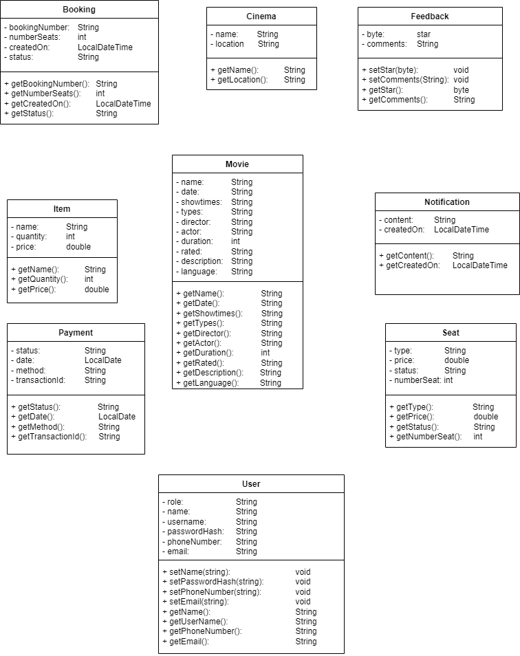

# 🌟 Movie Booking System - Chi Tiết Các Hàm Xử Lý 🌟

---

## 1. Đăng Nhập Vào Hệ Thống
1. **Mở ứng dụng Movie Booking System.**
2. **Nhập tên đăng nhập và mật khẩu của bạn.**
3. **Nhấn nút "Đăng nhập".**
4. **Nếu bạn chưa có tài khoản, chọn "Đăng ký" để tạo tài khoản mới.**

---

## 2. Chức Năng Cho Người Dùng
### 2.1 Chọn Phim
1. **Từ giao diện chính, chọn mục "Phim".**
2. **Duyệt qua danh sách các phim đang chiếu.**
3. **Nhấn vào tên phim để xem chi tiết, bao gồm thông tin về đạo diễn, diễn viên, thời gian chiếu và mô tả.**

### 2.2 Kiểm Tra Thời Gian Chiếu
1. **Trong trang chi tiết phim, tìm phần "Thời gian chiếu".**
2. **Xem lịch chiếu theo ngày và giờ. Chọn thời gian phù hợp với bạn.**

### 2.3 Chọn Chỗ Ngồi
1. **Nhấn nút "Chọn chỗ ngồi" trên trang chi tiết phim.**
2. **Sử dụng sơ đồ chỗ ngồi để chọn vị trí mong muốn.**
3. **Kiểm tra tình trạng chỗ ngồi (còn trống/đã đặt).**
4. **Nhấn nút "Xác nhận chọn chỗ" để lưu lựa chọn.**

### 2.4 Thanh Toán Trực Tuyến
1. **Sau khi chọn chỗ ngồi, nhấn nút "Thanh toán".**
2. **Nhập thông tin thẻ tín dụng hoặc phương thức thanh toán khác.**
3. **Kiểm tra lại thông tin và nhấn "Xác nhận thanh toán".**
4. **Nhận thông báo xác nhận đặt vé qua email và trong ứng dụng.**

### 2.5 Quản Lý Thông Báo
1. **Vào mục "Thông báo" trong tài khoản của bạn.**
2. **Xem các thông báo về đặt vé, chương trình khuyến mãi, và các thông tin quan trọng khác.**
3. **Nhấn vào thông báo để xem chi tiết.**

### 2.6 Xem Lịch Sử Đặt Vé
1. **Chọn mục "Lịch sử đặt vé" trong tài khoản của bạn.**
2. **Xem danh sách các vé đã đặt, bao gồm thông tin phim, thời gian chiếu, và trạng thái.**
3. **Nhấn vào từng vé để xem chi tiết hoặc hủy đặt vé nếu cần.**

---

## 3. Chức Năng Cho Admin
### 3.1 Quản Lý Phim
1. **Đăng nhập vào tài khoản admin.**
2. **Chọn mục "Quản lý phim".**
3. **Nhấn "Thêm phim" để nhập thông tin phim mới.**
4. **Nhập các thông tin cần thiết (tên, đạo diễn, diễn viên, thời gian chiếu, mô tả, thể loại).**
5. **Nhấn "Lưu" để thêm phim vào hệ thống.**
6. **Để chỉnh sửa hoặc xóa phim, chọn phim từ danh sách và nhấn "Chỉnh sửa" hoặc "Xóa".**

### 3.2 Quản Lý Đặt Vé
1. **Trong giao diện admin, chọn mục "Quản lý đặt vé".**
2. **Xem danh sách các đặt vé hiện tại.**
3. **Nhấn vào mỗi đặt vé để xem chi tiết và trạng thái.**
4. **Có thể xác nhận hoặc hủy đặt vé từ đây.**

### 3.3 Quản Lý Thông Báo
1. **Chọn mục "Quản lý thông báo".**
2. **Nhấn "Gửi thông báo mới".**
3. **Nhập nội dung thông báo và chọn đối tượng nhận.**
4. **Nhấn "Gửi" để phát thông báo đến người dùng.**

---

## 4. Tính Năng AI
### 4.1 Phân Tích Nhận Xét Phim
1. **Sau khi xem phim, bạn có thể để lại nhận xét.**
2. **Hệ thống sẽ phân tích và tổng hợp nhận xét của bạn để đánh giá tích cực, tiêu cực, bình thường.**

### 4.2 Đề Xuất Phim
- **Hệ thống sẽ tự động đề xuất phim theo ngày dựa theo mong muốn của người dùng. Hệ thống sử dụng AI để phân tích mong muốn từ người dùng để gợi ý phim từ người dùng.**

### 4.3 Đánh Giá Phim Để AI Phân Tích
1. **Chọn phim bạn đã xem.**
2. **Nhấn nút "Đánh giá" và chọn mức xếp hạng.**
3. **Nhấn "Gửi" để lưu đánh giá của bạn.**

---

## 5. Quản Lý Thông Báo
1. **Người dùng sẽ nhận thông báo qua email và trong ứng dụng về các sự kiện quan trọng như:**
    - **Xác nhận đặt vé thành công.**
    - **Cập nhật thông tin phim mới.**
    - **Chương trình khuyến mãi và ưu đãi.**
2. **Admin có thể gửi thông báo đến người dùng để thông báo về các sự kiện đặc biệt hoặc thay đổi lịch chiếu.**

---

## 6. Thanh Toán
### 6.1 Quy Trình Thanh Toán
1. **Sau khi chọn chỗ ngồi, nhấn nút "Thanh toán".**
2. **Nhập thông tin thẻ tín dụng hoặc phương thức thanh toán khác.**
3. **Kiểm tra lại thông tin và nhấn "Xác nhận thanh toán".**
4. **Nhận thông báo xác nhận thanh toán qua email và trong ứng dụng.**
5. **Nếu thanh toán không thành công, hệ thống sẽ thông báo và cho phép bạn thử lại.**

### 6.2 Lịch Sử Thanh Toán
1. **Người dùng có thể xem lịch sử thanh toán trong mục "Lịch sử thanh toán" trong tài khoản.**
2. **Xem chi tiết các giao dịch, bao gồm ngày, số tiền, và trạng thái thanh toán.**

---

# 🌟 UML 🌟

---
### 🚀 Thank you!